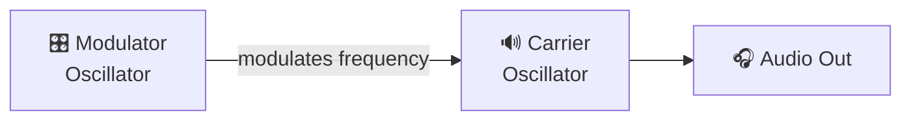
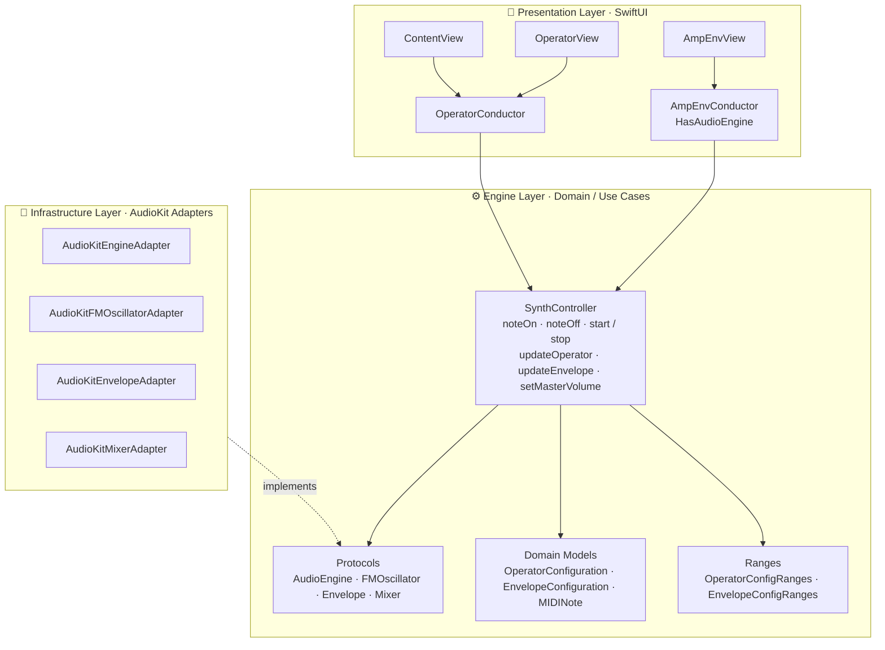
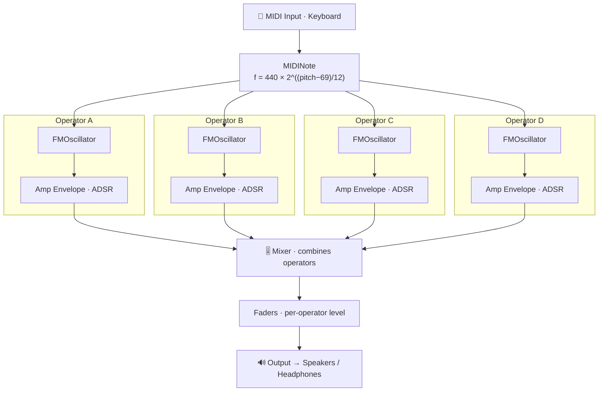
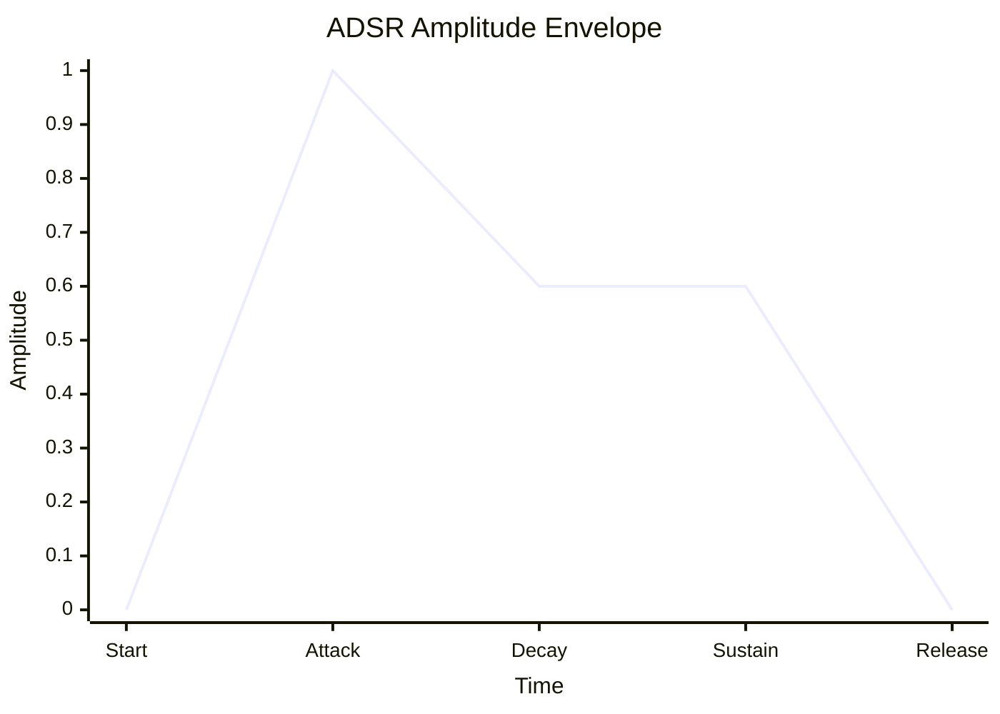

# Vampire Synth


<p align="center">
  <a href="https://github.com/tattva20/VampireSynth/actions/workflows/ci.yml">
    
  </a>
  
  
  
  
</p>

<p align="center">
  A 4-operator FM synthesizer for iOS built with <strong>AudioKit</strong> and <strong>SwiftUI</strong>, featuring <strong>Clean Architecture</strong>, <strong>TDD</strong>, and comprehensive test coverage (60+ tests).
</p>

## Table of Contents

- [Overview](#overview)
- [How FM Synthesis Works](#how-fm-synthesis-works)
- [Architecture](#architecture)
- [Signal Flow](#signal-flow)
- [Project Structure](#project-structure)
- [Testing](#testing)
- [Features](#features)
- [Requirements](#requirements)
- [Installation](#installation)
- [Usage](#usage)
- [Future Plans](#future-plans)
- [License](#license)
- [Credits](#credits)

---

## Overview

**Vampire Synth** is a virtual FM (Frequency Modulation) synthesizer that provides real-time sound synthesis using four independent operators. Each operator consists of an FM oscillator paired with an ADSR amplitude envelope, allowing for complex and evolving timbres characteristic of classic FM synthesizers like the Yamaha DX7.

The app is built with a protocol-oriented Clean Architecture approach, making it highly testable and maintainable.

---

## How FM Synthesis Works

### The Basics of FM Synthesis

FM synthesis creates complex waveforms by using one oscillator (the **modulator**) to modulate the frequency of another oscillator (the **carrier**). Unlike subtractive synthesis which filters harmonically rich waveforms, FM synthesis builds complexity through frequency modulation.



### Key Parameters

| Parameter | Description | Effect on Sound |
|-----------|-------------|-----------------|
| **Carrier Frequency** | Base pitch of the sound | Determines the perceived pitch |
| **Modulator Frequency** | Frequency of the modulating oscillator | Affects harmonic content |
| **Modulation Index** | Depth of frequency modulation (0-100) | Higher = more harmonics/brightness |
| **Carrier Multiplier** | Ratio multiplier for carrier | Shifts harmonic series |
| **Modulating Multiplier** | Ratio multiplier for modulator | Changes harmonic relationships |
| **Amplitude** | Output level (0-1) | Controls volume of operator |

### The FM Equation

The output of an FM oscillator can be expressed as:

$$
\text{output}(t) = A \cdot \sin\!\big(2\pi f_c\, t + I \cdot \sin(2\pi f_m\, t)\big)
$$

| Symbol | Meaning |
|--------|---------|
| $A$ | Amplitude |
| $f_c$ | Carrier frequency |
| $f_m$ | Modulator frequency |
| $I$ | Modulation index |
| $t$ | Time |

### Harmonic Ratios

When the carrier and modulator frequencies are in simple ratios, the result is harmonic:

| Ratio (C:M) | Sound Character |
|-------------|-----------------|
| 1:1 | Bright, buzzy |
| 1:2 | Bell-like, metallic |
| 1:3 | Hollow, clarinet-like |
| 2:1 | Octave harmonics |
| Non-integer | Inharmonic, bell/gong sounds |

---

## Architecture

Vampire Synth follows **Clean Architecture** principles with a protocol-oriented design, inspired by best practices from professional iOS codebases.

### Layer Diagram



### Design Principles

#### Protocol-Oriented Design

All audio components are abstracted behind protocols, enabling:
- **Testability**: Test spies can replace real audio components
- **Flexibility**: Easy to swap implementations
- **Decoupling**: Engine layer has no AudioKit dependencies

```swift
// Protocol definition (Engine Layer)
public protocol FMOscillatorProtocol: OscillatorProtocol {
    var baseFrequency: Float { get set }
    var carrierMultiplier: Float { get set }
    var modulatingMultiplier: Float { get set }
    var modulationIndex: Float { get set }
    var amplitude: Float { get set }
}

// Concrete implementation (Infrastructure Layer)
public final class AudioKitFMOscillatorAdapter: FMOscillatorProtocol {
    public let oscillator: FMOscillator
    // ... wraps AudioKit's FMOscillator
}
```

#### Dependency Inversion

The `SynthController` depends on abstractions, not concrete implementations:

```swift
public final class SynthController {
    private let engine: AudioEngineProtocol      // Protocol
    private let oscillators: [FMOscillatorProtocol]  // Protocol
    private let envelopes: [EnvelopeProtocol]    // Protocol
    private let mixer: MixerProtocol             // Protocol

    // Dependencies injected through initializer
    public init(
        engine: AudioEngineProtocol,
        oscillators: [FMOscillatorProtocol],
        envelopes: [EnvelopeProtocol],
        mixer: MixerProtocol
    ) { ... }
}
```

---

## Signal Flow

### Audio Signal Chain



### ADSR Envelope Stages



| Stage | Meaning | Range |
|-------|---------|-------|
| **A** — Attack | Time to reach peak | 0.001 – 2.0 s |
| **D** — Decay | Time to fall to sustain | 0.001 – 2.0 s |
| **S** — Sustain | Level held while key pressed | 0.0 – 1.0 |
| **R** — Release | Time to fade after key release | 0.001 – 2.0 s |

---

## Project Structure

```
VampireSynth/
├── VampireSynth/
│   ├── VampireSynthApp.swift          # App entry point
│   ├── ContentView.swift              # Main view composition
│   │
│   ├── Engine/                        # Domain Layer (Framework-agnostic)
│   │   ├── Protocols/
│   │   │   ├── AudioEngineProtocol.swift
│   │   │   ├── OscillatorProtocol.swift
│   │   │   ├── EnvelopeProtocol.swift
│   │   │   └── MixerProtocol.swift
│   │   │
│   │   ├── Models/
│   │   │   ├── OperatorConfiguration.swift
│   │   │   ├── EnvelopeConfiguration.swift
│   │   │   └── MIDINote.swift
│   │   │
│   │   └── SynthController.swift      # Main use case / business logic
│   │
│   ├── Infrastructure/                # AudioKit Implementations
│   │   ├── AudioKitEngineAdapter.swift
│   │   ├── AudioKitFMOscillatorAdapter.swift
│   │   ├── AudioKitEnvelopeAdapter.swift
│   │   └── AudioKitMixerAdapter.swift
│   │
│   ├── Presentation/                  # Views & Conductors
│   │   ├── Views/
│   │   │   ├── OperatorView.swift
│   │   │   ├── OperatorControlView.swift
│   │   │   ├── AmpEnvView.swift
│   │   │   ├── ADSRWidgetView.swift
│   │   │   └── VampireKeyboardView.swift
│   │   │
│   │   └── Conductors/
│   │       ├── OperatorConductor.swift
│   │       └── AmpEnvConductor.swift
│   │
│   └── Utilities/
│       └── Operator.swift             # Operator ID constants
│
└── VampireSynthTests/
    ├── Engine Tests/
    │   ├── SynthControllerTests.swift
    │   ├── MIDINoteTests.swift
    │   ├── OperatorConfigurationTests.swift
    │   └── EnvelopeConfigurationTests.swift
    │
    └── Helpers/
        ├── Test Spies/
        │   ├── AudioEngineSpy.swift
        │   ├── FMOscillatorSpy.swift
        │   ├── EnvelopeSpy.swift
        │   └── MixerSpy.swift
        │
        └── XCTestCase+MemoryLeakTracking.swift
```

---

## Testing

### Test Architecture

The project uses **Test Spies** to verify behavior without real audio processing:

```swift
// Test Spy records all interactions
final class FMOscillatorSpy: FMOscillatorProtocol {
    enum Message: Equatable {
        case start
        case stop
        case setBaseFrequency(Float)
        case setModulationIndex(Float)
        // ...
    }

    private(set) var messages: [Message] = []

    var baseFrequency: Float = 440 {
        didSet { messages.append(.setBaseFrequency(baseFrequency)) }
    }
    // ...
}

// Test verifies expected behavior
func test_noteOn_setsBaseFrequencyOnAllOscillators() {
    let (sut, _, oscillators, _, _) = makeSUT()
    let note = MIDINote(pitch: 69) // A4 = 440Hz

    sut.noteOn(note)

    oscillators.forEach { oscillator in
        XCTAssertTrue(oscillator.messages.contains(.setBaseFrequency(440.0)))
    }
}
```

### Test Coverage

| Component | Tests | Coverage |
|-----------|-------|----------|
| SynthController | 16 | Note on/off, operator updates, envelope updates, memory leaks |
| MIDINote | 6 | Frequency calculation, equality |
| OperatorConfiguration | 5 | Defaults, custom values, ranges |
| EnvelopeConfiguration | 4 | Defaults, custom values, ranges |
| **Total** | **31** | |

### Memory Leak Detection

All tests include automatic memory leak tracking:

```swift
func trackForMemoryLeaks(_ instance: AnyObject, file: StaticString = #filePath, line: UInt = #line) {
    addTeardownBlock { [weak instance] in
        XCTAssertNil(instance, "Instance should have been deallocated. Potential memory leak.", file: file, line: line)
    }
}
```

### Running Tests

```bash
# Run all tests via Xcode
xcodebuild test -scheme VampireSynth -destination 'platform=iOS Simulator,name=iPhone 16'

# Or use Cmd+U in Xcode
```

---

## Features

- **4-Operator FM Synthesis**: Independent operators (A, B, C, D) each with configurable FM parameters
- **Per-Operator ADSR Envelopes**: Shape the amplitude of each operator independently
- **Real-time Parameter Control**: Adjust all parameters while playing
- **MIDI Keyboard**: On-screen keyboard with touch response
- **Octave Shift**: Transpose the keyboard range (-2 to +3 octaves)
- **Dark Mode UI**: Sleek interface optimized for dark mode
- **Collapsible Sections**: Organize operator and envelope controls
- **Clean Architecture**: Testable, maintainable codebase

---

## Requirements

### Hardware
- iOS device with iOS 17.5 or later
- External MIDI controller (optional)

### Software
- Xcode 15.0 or later
- AudioKit 5.6+ (via Swift Package Manager)

---

## Installation

1. **Clone the Repository**:
    ```bash
    git clone https://github.com/your-repo/vampire-synth.git
    cd vampire-synth
    ```

2. **Open in Xcode**:
    ```bash
    open VampireSynth.xcodeproj
    ```

3. **Resolve Dependencies**:
    - Xcode will automatically fetch AudioKit packages
    - Wait for package resolution to complete

4. **Build and Run**:
    - Select your target device (iPhone/iPad)
    - Press `Cmd + R` to build and run

---

## Usage

### Playing Notes

1. **On-Screen Keyboard**: Touch keys to trigger notes
2. **Octave Shift**: Use the stepper to change the keyboard range
3. **MIDI Input**: Connect an external MIDI controller for hardware control

### Adjusting Operators

Each operator provides sliders for:
- **Modulation Frequency**: 20 - 2000 Hz
- **Modulation Multiplier**: 0.1 - 10.0
- **Modulation Index**: 0 - 100
- **Amplitude**: 0 - 1.0

### Shaping Envelopes

Each operator has an ADSR envelope with visual control:
- Drag the envelope points to adjust Attack, Decay, Sustain, and Release
- Changes apply in real-time

### Sound Design Tips

| Desired Sound | Settings |
|--------------|----------|
| **Bright, metallic** | High mod index (50-100), 1:1 ratio |
| **Bell/chime** | Med mod index (20-40), non-integer ratios |
| **Soft pad** | Low mod index (5-15), slow attack |
| **Bass** | Low mod freq, high amp on Op A |
| **Evolving texture** | Different envelopes per operator |

---

## Future Plans

- [ ] Preset system (save/load configurations)
- [ ] Operator routing matrix (modulate operators with each other)
- [ ] Effects chain (reverb, delay, chorus)
- [ ] MPE (MIDI Polyphonic Expression) support
- [ ] Audio Unit (AUv3) plugin version
- [ ] Waveform visualization
- [ ] Undo/redo for parameter changes

---

## Troubleshooting

| Issue | Solution |
|-------|----------|
| **No sound** | Check device is not in silent mode; ensure audio session is active |
| **MIDI not working** | Verify MIDI device is connected and recognized |
| **Crackling audio** | Lower the number of active operators or reduce modulation index |
| **App crashes** | Check Xcode console for AudioKit initialization errors |

---

## License

This project is licensed under the **MIT License**. See the `LICENSE` file for details.

---

## Credits

- **Octavio Rojas** - Developer and creator
- **AudioKit Team** - Audio processing framework
- **Architecture patterns** inspired by Clean Architecture principles

---

## Acknowledgements

Special thanks to:
- The **AudioKit** community for their excellent audio framework
- The iOS developer community for Clean Architecture patterns
- Classic FM synthesizers (Yamaha DX7, Yamaha TX81Z) for inspiration
